<!--
*** Thanks for checking out this README Template. If you have a suggestion that would
*** make this better, please fork the repo and create a pull request or simply open
*** an issue with the tag "enhancement".
*** Thanks again! Now go create something AMAZING! :D
-->
# Hyacinth-documentation

<!-- PROJECT LOGO -->
<p align="center">
  <a href="">
    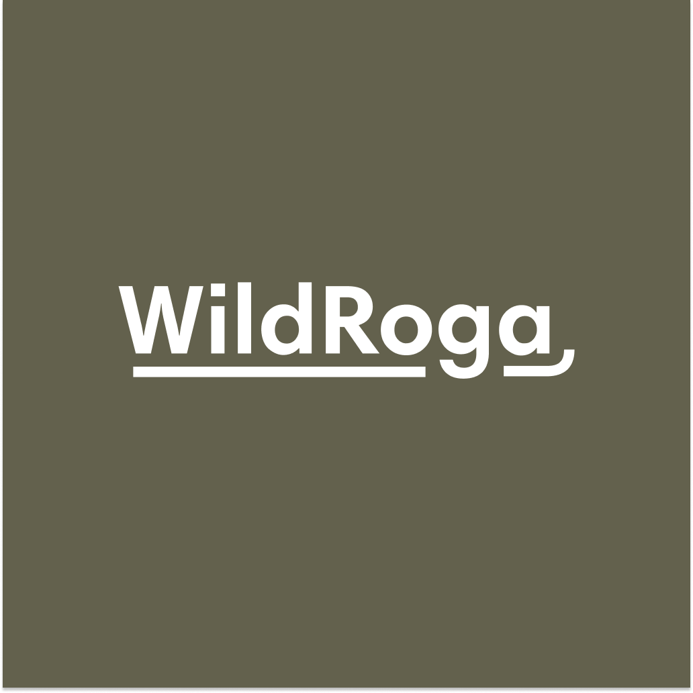
  </a>

  <h3 align="center">WildRoga App & Dashboard</h3>

  <p align="center">
    Powered by Hyacinth
    <br />
    <a href=""><strong>Explore the docs »</strong></a>
    <br />
    <br />
    <a href="https://youtu.be/b4bjSfCqqUQ?t=261">View Demo</a>
    ·
    <a href="https://github.com/Team-1-Hyacinth/wildroga-app/issues">Report Bug</a>
    ·
    <a href="">Request Feature</a>
    .
    <a href="https://drive.google.com/drive/folders/17MNyIEBvzEC989yDFF1FdDRn2B96o0vp?usp=sharing">APP Docs</a>
  </p>
</p>

<!-- TABLE OF CONTENTS -->

## Table of Contents

- [About the Project](#about-the-project)
  - [Built With](#built-with)
- [User Research](#user-research)
- [Product Research](#product-research)
- [Personas](#personas)
- [Usage Scenarios](#usage-scenario)
- [Information Architecture](#information-architecture)
- [Paper Prototype](#paper-prototype)
- [Wireframes](#wireframes)
- [Visual Design](#visual-design)
- [Usability Testing Documents](#usability-testing-documentation)
- [Usability Test Results](#usability-test-results)
- [Interactive Visual MockUp](#interactive-visual-mockup)
- [Features](#features)
- [High-Level Architecture](#high-level-architecture)
- [Technical Research](#technical-research)
- [Getting Started](#getting-started)
  - [Prerequisites](#prerequisites)
  - [Installation](#installation)
- [Usage](#usage)
- [Roadmap](#roadmap)
- [Contact](#contact)
- [Acknowledgements](#acknowledgements)

<!-- ABOUT THE PROJECT -->

## About The Project

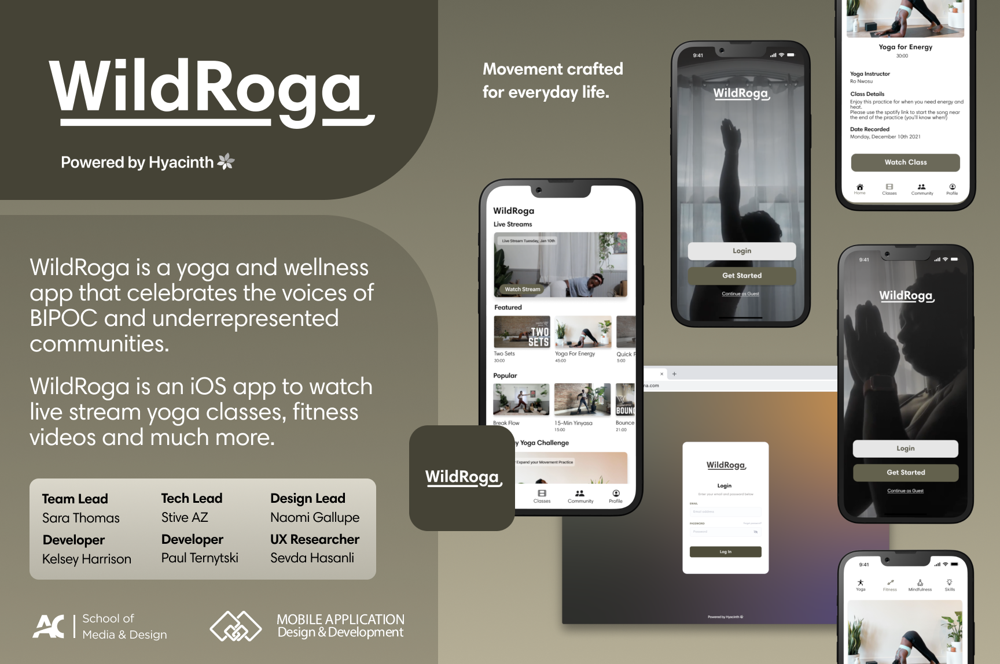

WildRoga is a yoga and wellness app that celebrates the voices of BIPOC and underrepresented communities. The app offers live streams, fitness videos, wellness talks, and so much more. Join and create an experience that best suits your needs. [Read more...](https://www.algonquincollege.com/arie/2022/03/wildroga-app/)

### Built With
#### Major Frameworks

- [Next.js](https://nextjs.org/docs/getting-started)
- [Stripe](https://stripe.com/docs)
- [Firebase](https://firebase.google.com/)
- [MUX](https://docs.mux.com/guides/video)
- [Ecamm Live](https://www.ecamm.com/)
- [Expo](https://docs.expo.dev/)

#### Development Toolkit:

- [WebStorm](https://www.jetbrains.com/webstorm/) (IDE)
- [VS Code](https://code.visualstudio.com/) (IDE)
- [Expo](https://expo.io/)

#### Accounts made for the hyacinth.algonquin@gmail.com under the specified password

- [x] Firebase - created under hyacinth.algonquin@gmail.com
- [x] Expo - created under hyacinth.algonquin@gmail.com
- [x] Netlify - With Web Deployed created under hyacinth.algonquin@gmail.com

<!-- Features list -->

## App Features

- [x] Watch livestream class
- [x] Community wall feed
- [X] Paid membership tier
- [x] Fitness tracker (phase 2)

## Dashboard Features

- [x] Start live stream classes
- [x] Upload, edit and delete videos content
- [x] Upload, edit and delete community wall posts

<!-- User Research -->

## User Research

[User Research](https://docs.google.com/spreadsheets/d/1z3UYh0lckzXt8RU-1YmqUo4WokWSVRy9/edit?usp=sharing&ouid=115252459320742425262&rtpof=true&sd=true)

- Resarch data from a survey distributed to potential users.

<!-- Product Research -->

## Product Research

[Product Research](https://docs.google.com/spreadsheets/d/1Bu5T6eAY1mAIwf06pP7FbXseCrq1JtL-/edit#gid=992087464)

- Research about the market, our competitors, and brand.

<!-- Personas -->

## Personas

[Personas](https://drive.google.com/file/d/1LWAZmf0uScTIaCaHjRiRlnnnT1AX_yrL/view?usp=sharing)

- Four personas one for admin, two for primary and two for secondary users.

<!-- Usage Scenarios -->

## Usage Scenarios

[Usage Scenarios](https://docs.google.com/document/d/1aAWrMSvnRF0JZ98C99XDtuf_rOLYJ-Bw/edit?usp=sharing&ouid=115252459320742425262&rtpof=true&sd=true)

- Four Scenarios one for admin / primary user, and three for secondary users.

<!-- Information Architecture -->

## Information Architecture

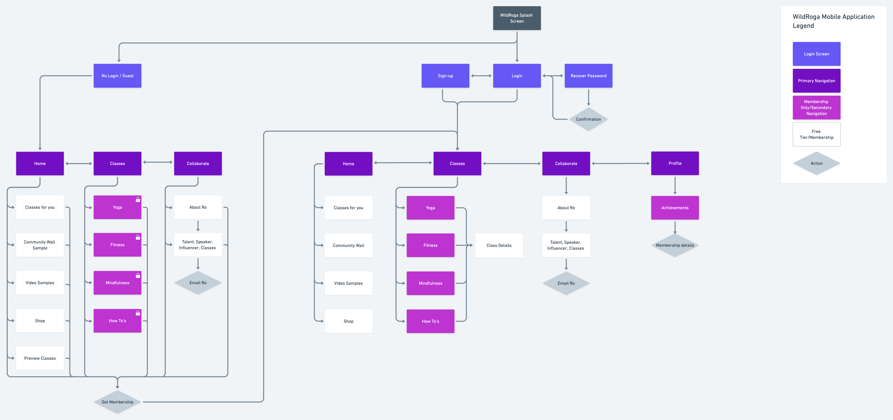

- Information Architecture to lay out the structure of Project Name.

<!-- Paper Prototyep -->

## Paper Prototype

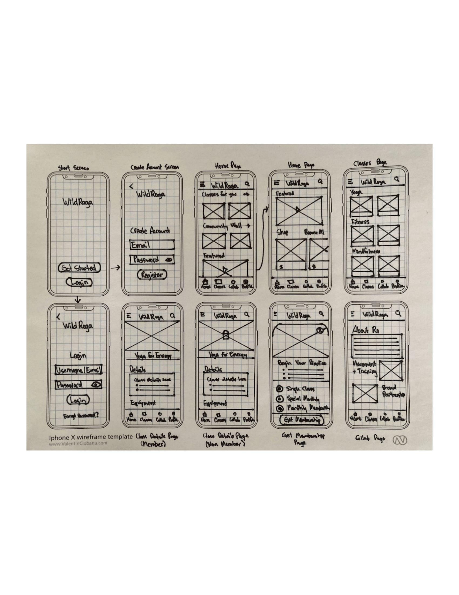

<!-- Wireframes -->

## Wireframes

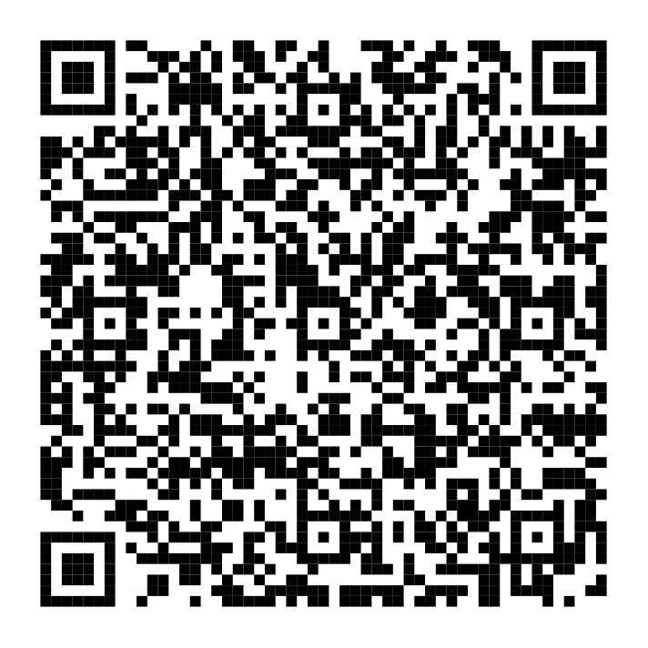


<!-- Visual Design -->

## Visual Design

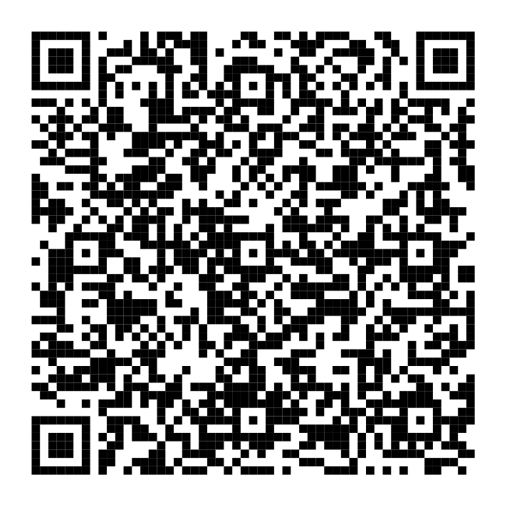


<!-- Interactive Visual MockUp -->

## Interactive Visual MockUp

[Interactive Visual MockUp](https://www.figma.com/proto/41Hg4Halg1HIQ54mQ4Pdqx/visualDesign-Hyacinth?scaling=scale-down&page-id=0%3A1&node-id=7%3A177&starting-point-node-id=7%3A177)

- Download the file and open with Figma.

<!-- Usability Testing Documentation -->

## Usability Testing Documentation

[Usability Testing Documentation test plan](https://docs.google.com/document/d/11sobyxA-MNXzN_ZVwv3c_KsF3uoXPKVDkiueE1jaaf8/edit?usp=sharing)

[Usability Testing Documentation test script](https://docs.google.com/document/d/1duQjv2wI-66w6hck-pelS-kpuodSdmAhI6zYH3nAHKo/edit?usp=sharing)

- Usability Testing Documentation folder contains 'Test Plan' and 'Test Script'

<!-- Usability Test Results -->

## Usability Test Results

[Usability Test Results](https://docs.google.com/document/d/151JTmKRcmPq3Ta91aJq7DvnZ22hN03c2/edit?usp=sharing&ouid=115252459320742425262&rtpof=true&sd=true)

- Information about the participants and findings.

<!-- High-Level Architecture -->

## High-Level Architecture

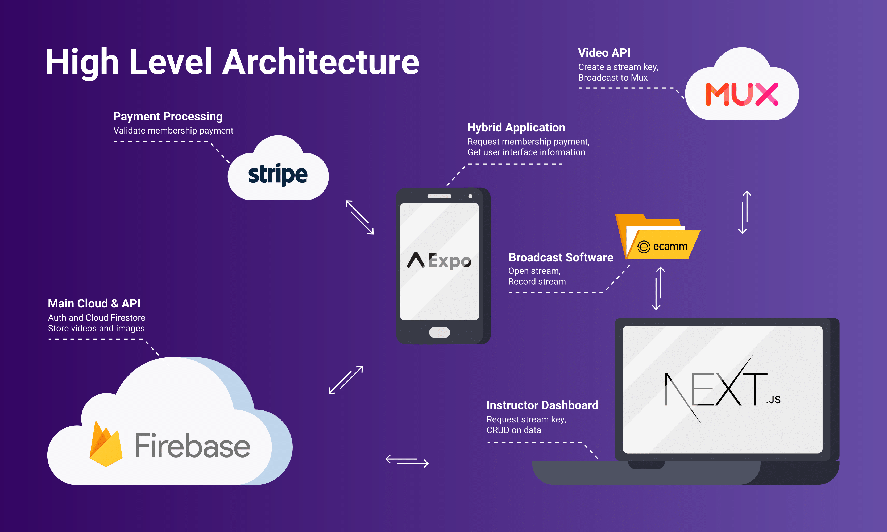

Describe in brief about your high-level architecture.

<!-- Technical Research -->

## Technical Research

[Technical Research Document](https://docs.google.com/document/d/1c6KC3qTwPs0Pc0epZ14JldHm3Mlta9ojceHZWiWOMjY/edit?usp=sharing)

Summary of your technical research and attach the technical research document.

<!-- Getting Started -->

## Getting Started

This is an example of how you may give instructions on setting up your project locally.
To get a local copy up and running follow these simple example steps.

To get a local copy up and running follow these simple example steps.

### Prerequisites

This is an example of how to list things you need to use the software and how to install them.

#### WildRoga - Hyacinth Mobile App

- Clone the app repository

- Install Node (recommended v16): [Node.js](https://nodejs.org/en/)

- Install Globally the Expo CLI

```sh
npm i -g expo-cli
```

- Install the npm packages

```sh
npm i
```

- Paste the .env file in the project root

- Run Locally

```sh
expo start
```

#### WildRoga - Hyacinth Dashboard

- Clone the dashboard repository

- Install Node (recommended v16): [Node.js](https://nodejs.org/en/)

- Install the npm packages

```sh
npm i
```

- Paste the .env file in the project root

- Run Locally

```sh
npm run dev
```

## Usage

Download the [Expo Go](https://expo.dev/client) app for iOS or Android, and scan the QR Code below to run Smart Tenant on your device.

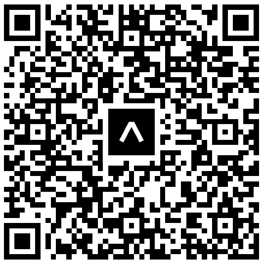

#### Current Screens in Development for Phase 1:

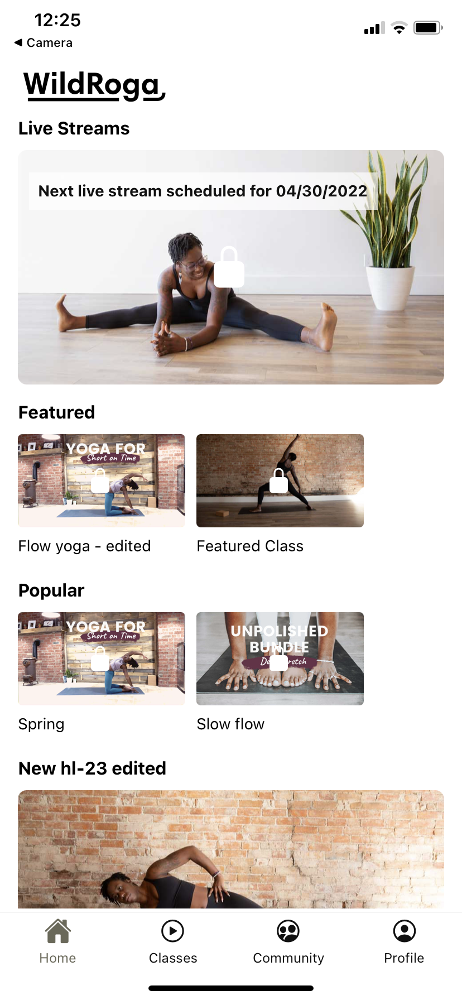
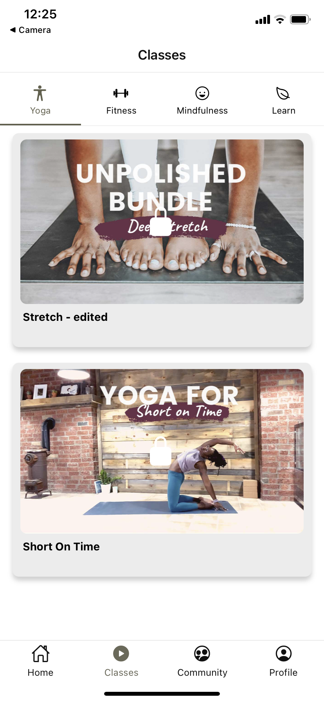
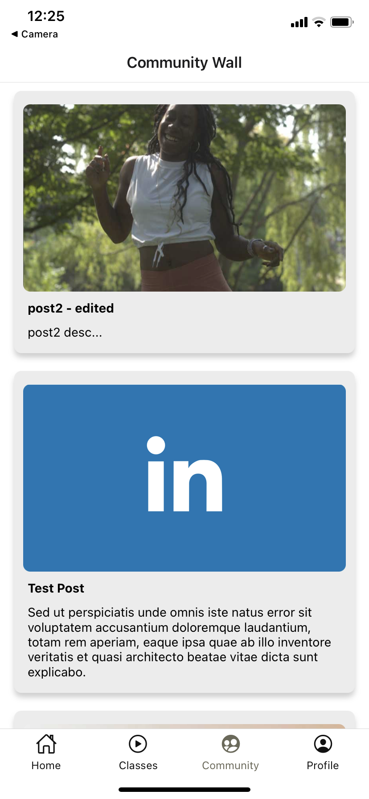
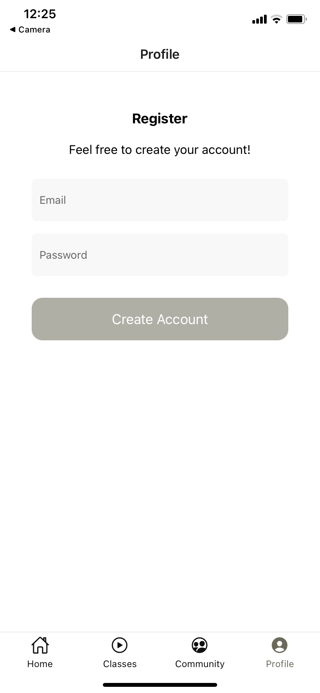
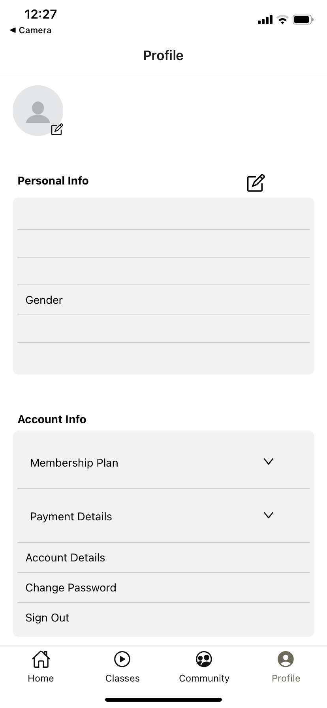
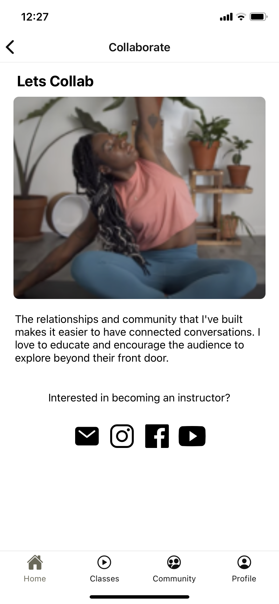

<!-- ROADMAP -->

## Roadmap

List of Sprint two features (and known issues, if any).

- Phase 1 completed
- Phase 1.5
    - Community wall, alow users to comment on posts and videos
    - Notifications and reminders
    - In app shop
- Phase 2
    - Community wall, alow users to create their own posts
    - Fitness tracker
- Additional requested features

<!-- Contact -->
## Contact

**Project Lead:** [Sara Thomas](mailto:thom1461@algonquinlive.com)

**Design Lead:** [Naomi Gallupe](mailto:gall0381@algonquinlive.com)

**Technical Lead:** [Stive AZ](mailto:aven0006@algonquinlive.com)

**Developer:** [Kelsey Harrison](mailto:harr0627@algonquinlive.com)

**Developer:** [Pavlo Ternytskyi](mailto:tern0004@algonquinlive.com)

**UX Designer & Researcher:** [Sevda Hasanli](mailto:hasa0072@algonquinlive.com)

<!-- Acknowledgements -->
## Acknowledgements

This project is the sum of 4 months of hard work, collaboration, and commitment to building the best product we could, given the amount of time we had. In many ways, this project has laid the groundwork for the beginning of our professional careers as we approach graduation. We’d like to thank our professors, Algonquin College, and our client Ro, for an amazing and unforgettable opportunity. Thank you all very much!
